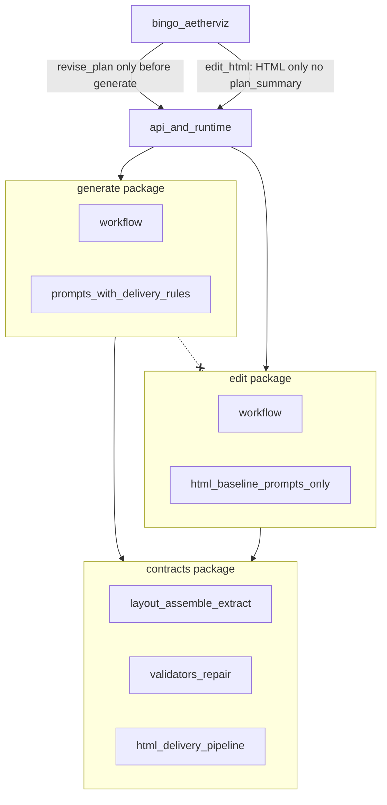

# 生成/编辑双线物理隔离计划

## 目标与边界

硬规则：

1. **编辑以当前 HTML 为唯一事实基线**；不再用 plan 或生成向交付 prompt 去“再教一遍”怎么画页面。
2. **Plan 生命周期锁死**：仅在点击生成 HTML **之前**可修改；生成后 plan 不可再作为聊天上下文被引用或修订。
3. **生成与编辑业务代码互不 import**。
4. **不复制**安全、长度、布局壳装配、widget 运行时等**执行期契约**；它们抽到第三层 `contracts/`（校验/装配，不是 prompt）。




## 新增约束 A：Plan 只能服务「生成 HTML」

### 产品语义

- `plan` / `revise_plan` / `approve_plan`：**仅生成前**有效。
- 用户一旦发起生成（`hasGenerationAttempted` / 已有预览页），教学方案：
  - **不可**再作为上下文引用项出现在输入框；
  - **不可**再通过选中 plan 触发 `revise_plan`；
  - 后续用户消息默认走 `edit_html`（以当前 HTML 分支为基线）。
- Plan 不是编辑线的语义权威；页面已经偏离 plan 是预期现象。

### 前端（`[bingo-aetherviz](../bingo-aetherviz)`）

关键改动点：

- `[useAetherVizSession.ts](../bingo-aetherviz/src/hooks/useAetherVizSession.ts)`
  - `contextReferences`：生成已尝试或已有 HTML 页后，**过滤掉** `type === "plan"`。
  - `handleSubmit`：删除「选中 plan → revise」在生成后的可达路径；生成后仅 `edit_html` / 明确 HTML 上下文。
  - `editSelectedHtmlFromInstruction` / `buildChatContext`：编辑请求 **不传 `plan_summary`**（传 `null` 或不带该字段）。
- `[chatMemory.ts](../bingo-aetherviz/src/features/aetherviz/chatMemory.ts)`
  - 增加 `buildEditChatContext`（或给 `buildChatContext` 加 `includePlan: false`），编辑路径强制无 plan。
- Chat UI：若当前仍选中 plan 且生成已发生，自动切到最新 HTML 引用或清空 plan 选择。

### 后端守门（防旧客户端）

- `phase=edit_html`：诊断上下文 **丢弃** `context.plan_summary` 的业务语义字段（可保留 topic）；装配优先 HTML 内 shell 元数据。
- 文档写明：编辑请求携带 `plan_summary` 会被忽略，不参与指令编译与重生成。

## 新增约束 B：编辑线不吃「生成向交付 prompt」

你指出的问题成立：视觉 / 数值 / 图形 / 布局壳说明 / 舞台居中等片段是为 **从 plan 生成 HTML** 设计的；编辑时这些规则已沉淀在当前 HTML 里，再注入 system prompt 会与页面现状抢话语权，干扰微调与大改。

### Prompt 归属（修正原方案）


| 去向                           | 内容                                                                                                                                                       |
| ---------------------------- | -------------------------------------------------------------------------------------------------------------------------------------------------------- |
| `**generate/prompts.py` 独占** | `VISUAL_DESIGN_`*、`NUMERIC_*`、`GRAPHICS_*`、`SERVER_LAYOUT_*`、`STAGE_CENTERING_*`、`WIDGET_CORE`、interactive_type 路由、`build_interactive_generation_prompt` |
| `**edit/prompts.py` 独占**     | 精简 `EDIT_HTML_SYSTEM_PROMPT`：以当前 HTML 为唯一基线、影响闭环、禁止仿制壳结构、截断/长度、widget 运行契约薄约束；**不引用**上述生成向交付片段                                                           |
| `**contracts/**`             | **不放** `prompts_shared.py`；只保留装配、校验、修复执行代码                                                                                                               |


编辑 human prompt 保持：`instruction + current business HTML`。诊断模型只吃 HTML 确定性摘要 + 用户指令 + 短会话消歧，**不含** plan、不含生成设计规范长文。

后处理仍用 `contracts.validation` / `assemble_layout_contract` 保证交付安全与壳结构；那是**代码契约**，不是再给模型念一遍生成说明书。

## 目标目录（物理隔离）

```text
generate/
  workflow.py
  html_agent.py
  prompts.py              # 含全部生成向交付片段
  __init__.py

edit/
  workflow.py
  diagnosis.py
  regenerate.py
  context.py              # 不纳入 plan_summary 语义
  operations.py           # 休眠局部 ops
  function_agent.py
  prompts.py              # HTML 基线编辑 prompt，零生成交付片段
  __init__.py

contracts/
  pipeline.py
  layout.py
  validation/
  repair/
  html_io.py
  # 无 prompts_shared

workflow/                 # 仅 plan
agents/                   # planner、runtime、model_factory
```

**禁止 import：** `generate` ↔ `edit` 双向；`edit` **不得** import `generate.prompts`。

## 业务语义隔离

### 生成线（plan → HTML）

- 事实基线：`approved_plan`
- Prompt：完整生成向交付规则 + widget 蓝图
- IR 路由仅挂 generate

### 编辑线（HTML → HTML）

- 事实基线：当前业务 HTML
- Prompt：短编辑规则 + 完整 HTML；无视觉系统长文、无 plan 蓝图
- 诊断：消歧用 `recent_messages`，但不得用 plan 覆盖页面
- 修复：`include_plan_context=False`；策略由 edit 显式传入 pipeline

### 契约层

- 从 `generate_workflow` 抽出 `run_html_pipeline`
- API 显式化：`include_plan_in_repair`、`candidate_guard` 等，消除散落 `if phase == edit_html`

## 分阶段落地

### Phase 1 — 抽契约层（行为不变）

迁入 pipeline / layout / validators / repair；两边改依赖；现有测试全绿。

### Phase 2 — 物理搬家

建 `generate/`、`edit/`；runtime 改分发；import 边界测试；短生命周期 shim 后删除。

### Phase 3 — 编辑 prompt HTML-only（行为有意变化）

1. 重写 `edit/prompts.py`：删除对视觉/数值/布局/舞台片段的引用。
2. `edit/context.py`：从诊断摘要中移除 `plan` 字段（或恒为空）。
3. 更新相关单测（prompt 子串断言、edit context 字段）。
4. 回归：小改样式与跨层动画各抽几条手工/离线样本，确认模型更贴当前 HTML。

### Phase 4 — Plan 生命周期（前后端）

1. 前端：生成后移除 plan 上下文引用；阻断 revise；edit 不传 `plan_summary`。
2. 后端：edit 忽略 plan 语义；装配优先 HTML shell 元数据。
3. 进入 Phase 5 做文档同步（见下）。

**仍不包含**：重接线局部补丁、前端 `edit_target`、效果 Dataset。

### Phase 5 — 文档同步检查（收尾必做）

全部代码与前端改动完成后，**对照核对**并按需更新：

- [README.md](README.md)：工作流图 / `phase` 说明、`edit_html` 请求上下文（无 plan）、生成与编辑分线目录、plan 仅生成前可修订、编辑以当前 HTML 为基线且不注入生成向交付 prompt。
- [AGENTS.md](AGENTS.md)：架构原则中的包边界（`generate` / `edit` / `contracts` 互不业务耦合）、计划与提示词原则（编辑不依赖生成蓝图片段）、前后端协作中 plan 生命周期与契约变化。

核对清单：

1. 目录/模块描述是否仍写「workflow 里混装 generate+edit」。
2. `phase=edit_html` 是否仍暗示携带或依赖 `plan_summary`。
3. 是否仍写编辑会复用生成 system prompt / 视觉布局长片段。
4. 是否仍允许生成后通过上下文修订 plan。

若某段已准确则不改；若过时则更新。交付说明中写明「已核对 README/AGENTS，已更新 / 无需更新」。

## 关键文件

**后端**

- [edit_html_workflow.py](aetherviz_service/aetherviz/workflow/edit_html_workflow.py) → `edit/`
- [edit_diagnosis_agent.py](aetherviz_service/aetherviz/agents/edit_diagnosis_agent.py) → `edit/diagnosis.py`
- [edit_context.py](aetherviz_service/aetherviz/tools/edit_context.py) → 去 plan 语义
- [generate_workflow.py](aetherviz_service/aetherviz/workflow/generate_workflow.py) → `generate/` + `contracts/pipeline.py`
- [instructions.py](aetherviz_service/aetherviz/agents/instructions.py) → `generate/prompts.py` + `edit/prompts.py`（无共享交付 prompt 包）

**前端**

- [useAetherVizSession.ts](../bingo-aetherviz/src/hooks/useAetherVizSession.ts)
- [chatMemory.ts](../bingo-aetherviz/src/features/aetherviz/chatMemory.ts)
- [ChatInputBox.tsx](../bingo-aetherviz/src/components/chat/ChatInputBox.tsx)（若需 UI 文案）

## 验证

- Phase 1/2：现有测试 + import 边界测试
- Phase 3：编辑 prompt 快照/子串测试断言 **不含** 视觉系统色板、`SERVER_LAYOUT` 长段等；诊断 summary **无 plan**
- Phase 4：前端路由测试——生成后选 plan 不可达；edit 请求 payload 无 `plan_summary`；后端忽略旧客户端带来的 plan
- Phase 5：README / AGENTS.md 与实现一致（见上核对清单）
- SSE 事件码与成功分支行为保持兼容

## 风险

- 去掉编辑侧交付 prompt 后，模型可能更敢改视觉，也可能偶发破坏壳约定——靠 `contracts.layout` + validation 兜底，不靠再灌生成说明书。
- Plan 锁定后，「生成后想改教学方案」只能新建会话或显式产品入口（本计划不新增该入口）。
- 不做校验器双份复制。

