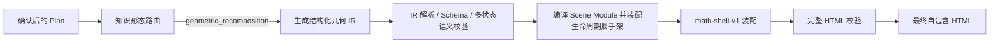

# 几何切分重排类 HTML 稳定生成方案

## 1. 文档状态

- 状态：结构化几何 IR / 受限表达式 DSL 已完成本地实现；最终 HTML 稳定性达标，持续收敛模型首稿与无 fallback 比例。
- 远端状态：LangSmith 数据集/evaluator 未创建，等待单独明确授权。
- 适用范围：`aether-viz-service` 的初始互动 HTML 生成、校验和修复链路。
- 目标形态：几何对象经过等分、切割、复制、旋转、平移或拼合，完成面积、体积或定理推导的互动课件。
- 非目标：为“圆的面积”等单个知识点增加专用静态 HTML 模板或关键词分支。

## 2. 背景与问题证据

本方案基于以下 LangSmith Trace：

- 计划阶段：`4e85f046-6096-4f6d-8e5e-82fb9c0465be`
- HTML 生成阶段：`829da683-de60-48f5-a1e4-7d84815de74e`

主题为“圆的面积推导”。计划将其归类为：

```text
subject = math
concept_family = geometry
representation_type = geometric_construction
pedagogy_pattern = proof_animation
```

当前分类能够表达“几何构造”和“证明动画”，但没有描述“同一组图形块从源状态重排到目标状态”这一关键运行形态，因此生成模型仍需自行设计完整 DOM、SVG、动画控制器和生命周期。

### 2.1 Trace 数据

| 阶段 | 结果 |
|---|---|
| 初次 HTML 生成 | 159.7 秒，8,794 输出 tokens，业务 HTML 33,816 字符，未截断 |
| 初次校验 | `structural_render_inside_animation_frame` |
| 确定性修复 | HTML 变为 33,719 字符，但原硬错误仍存在 |
| 模型修复 | 输入 9,954 tokens，输出达到 9,216 tokens 上限 |
| 模型修复结果 | 业务 HTML 36,639 字符，尾部截断 |
| 最终校验 | `js_syntax`、`truncated_model_output`，生成失败 |

### 2.2 实际违规调用链

初始 HTML 的调用关系为：

```text
GSAP onUpdate
  -> applyView(progress)
    -> updateLabels(progress)
      -> removeChild
      -> createElementNS
      -> appendChild
      -> updateFormulaPanel
        -> innerHTML
```

因此校验器不是误报。逐帧函数虽然名为 `applyView`，但它间接清空并重建 SVG 标签，还逐帧重新渲染公式。

### 2.3 当前修复链路的放大效应

当前模型修复需要重新输出完整 HTML，并同时收到以下问题：

- 一个硬错误：逐帧结构重建。
- 动态数值格式 warning。
- 缺少共享动画控制器 fallback warning。

模型因此同时重写标签逻辑、公式逻辑和动画控制器，输出体积增加并达到 token 上限。截断后，确定性闭合只能补充标签和括号，不能恢复丢失的事件绑定、Runtime 和业务语义。

当前修复候选接纳逻辑还存在一个问题：当错误签名发生变化时，即使候选从一个生命周期错误变成语法错误和截断错误，也可能被标记为已接受。

## 3. 总体目标

### 3.1 稳定性目标

- 模型不再负责通用动画生命周期。
- 动画帧内不创建、删除或替换 DOM/SVG 节点。
- 模型输出明显短于完整 HTML，避免修复输出触顶。
- 参数变化、重置和连续重建后，节点注册表保持一致。
- GSAP 可用和不可用时复用同一条 `progress -> frame -> apply` 路径。
- 生成结果仍是自包含、可解析、可运行的单页 HTML。

### 3.2 架构约束

- 继续由规范化计划驱动生成。
- 不增加单知识点静态模板。
- 分类必须覆盖一组可复用主题。
- 最终布局继续由 `math-shell-v1` 装配。
- 后端不持久化 HTML、修复稿或检查报告。
- 浏览器行为验证只进入本地或离线流程，不进入生产同步链路。
- 不引入通用 Agent harness、多 Agent 架构或额外生成框架。

## 4. 核心设计：服务端生命周期脚手架

服务端提供一套与具体知识点无关的几何重排运行框架。模型不再生成完整页面生命周期，而只生成受约束的场景模块。

### 4.1 职责分工

| 服务端负责 | 模型负责 |
|---|---|
| SVG 根节点和固定图层 | 几何计算 |
| 节点创建、销毁和注册表 | 图形块的局部路径或基础属性 |
| 播放、暂停、重置和速度 | 源状态 transform |
| `AetherVizAnimationController` | 目标状态 transform |
| 每帧属性应用 | 关键帧或进度区间 |
| iframe Runtime | caption、公式和展示状态 |
| 控件绑定和状态调度 | 学科语义和计划不变量 |
| 安全、结构和生命周期校验 | 不直接操作 DOM |

### 4.2 与知识点模板的区别

知识点模板会预先写死：

- 圆和扇形的 SVG 路径。
- `πr²` 公式。
- 8、16、32 等分逻辑。
- 圆到长方形的具体动画。

通用脚手架只知道：

- 存在一组具有稳定 id 的图形块。
- 图形块具有源状态和目标状态。
- 动画通过一个归一化进度从源状态过渡到目标状态。
- 拓扑变化只能发生在显式重建阶段。
- 每帧只能更新已有节点属性。

脚手架不知道图形块是扇形、三角形、梯形还是勾股拼图。

## 5. 新的生成链路



非 `geometric_recomposition` 类型继续使用现有直接 HTML 生成链路，避免一次性迁移所有互动形态。

## 6. 第一阶段 Scene Blueprint 契约（历史基线）

以下内容记录第一阶段从完整 HTML 收敛到小型 JavaScript `sceneBlueprint` 的中间方案。当前生产实现已继续收敛为第 21 节的纯 JSON 几何 IR，模型不再输出 `buildGeometry` JavaScript；保留本节用于说明演进依据和旧回归结果。

示意接口：

```js
const sceneBlueprint = {
  buildGeometry(state) {
    return {
      pieces: [
        {
          id: "piece-0",
          tag: "path",
          attrs: { d: "...", fill: "...", stroke: "..." },
          sourceTransform: { x: 0, y: 0, rotation: 0, scale: 1, opacity: 1 },
          targetTransform: { x: 120, y: 0, rotation: 90, scale: 1, opacity: 1 }
        }
      ],
      annotations: []
    };
  },
  displayFrames: [
    { at: 0, caption: "...", formula: "...", step: 0 },
    { at: 1, caption: "...", formula: "...", step: 2 }
  ]
};
```

服务端随后把 Blueprint 组合为完整 `sceneModule`，并通过 `sceneMath` 提供 clamp、线性插值、扇形路径和图形块 transform 插值。模型不能覆盖这些实现。

### 6.1 模块限制

`buildGeometry`：

- 只能返回普通数据。
- 不得调用 `document`、`window` 或 DOM API。
- piece id 必须唯一。
- 数组大小必须受计划变量上限约束。
- 所有数值必须是有限值。

`deriveFrame`：

- 只能返回属性数据。
- 不得创建或删除节点。
- 不得改变 piece id 集合。
- 不得调用 GSAP、`requestAnimationFrame` 或定时器。
- 不得写入 `innerHTML`。

`deriveDisplay`：

- 可见数值必须通过描述符驱动的格式化入口。
- caption、步骤和公式必须与同一 progress 对应。
- 公式字符串不变化时，运行时不得重复调用 KaTeX。

### 6.2 静态禁止项

模型模块禁止出现：

```text
document
window
createElement
createElementNS
appendChild
removeChild
replaceChildren
innerHTML
eval
Function
fetch
XMLHttpRequest
requestAnimationFrame
setInterval
gsap.timeline
gsap.to
```

最终装配后的服务端运行时代码仍可使用其中必要的 DOM 和动画 API，但模型模块本身不能使用。

## 7. 状态分类与生命周期

几何重排计划需要把状态变量分成三类：

```json
{
  "topology_variables": ["pieceCount"],
  "geometry_variables": ["scale"],
  "animation_variable": "progress"
}
```

### 7.1 拓扑变量

改变节点数量或节点类型，例如圆面积中的扇形数量。

固定执行顺序：

```text
pause
  -> clear registry
  -> buildGeometry
  -> create nodes
  -> validate registry
  -> reset progress
  -> apply frame 0
```

拓扑变化不得发生在动画帧内。

### 7.2 几何变量

不改变节点数量，但改变路径、尺寸或目标位置，例如半径、高、底边长度。

处理方式：

- 暂停或保持当前 progress。
- 重新计算几何描述。
- 更新现有节点的 `d`、transform 基线和标签数据。
- 重新应用当前 progress。

### 7.3 动画变量

只包含归一化进度或时间状态。

动画帧允许更新：

- `transform`
- `d`，仅限已验证的兼容路径插值；第一版不启用
- `x/y/cx/cy/r`
- `opacity`
- `stroke/fill`
- `textContent`
- class 或 ARIA 状态

动画帧禁止更新结构。

## 8. 第一版能力边界

为保证第一版可落地，先限制为：

- 二维 SVG。
- 源状态和目标状态使用同一组 piece id。
- 以 transform 动画为主。
- 图形数量只在参数变化时重建。
- 不逐帧新增、删除、拆分或合并节点。
- 不逐帧重渲染 KaTeX。
- 不支持任意 path morph。
- 不支持三维透视、粒子系统或物理模拟。

该范围能够覆盖：

- 圆面积的扇形切分与重排。
- 平行四边形割补成长方形。
- 三角形复制、旋转并拼合成平行四边形。
- 梯形复制并拼合成平行四边形。
- 菱形按对角线切分和重排。
- 勾股定理的有限图形拼图证明。

## 9. “圆的面积推导”映射示例

### 9.1 状态定义

```json
{
  "topology_variables": ["sectors"],
  "geometry_variables": ["radius"],
  "animation_variable": "progress",
  "invariants": [
    "piece_identity_preserved",
    "piece_count_constant_during_animation",
    "source_target_piece_sets_equal",
    "area_preserved"
  ]
}
```

### 9.2 `sectors` 变化

- 暂停动画。
- 重新生成 N 个扇形描述。
- 服务端清空并重建 N 个 path。
- 校验注册表长度等于 N。
- 重置 progress。

### 9.3 `radius` 变化

- 不改变 path 数量。
- 重新计算扇形局部路径。
- 重新计算源/目标 transform。
- 更新半径、周长和面积展示状态。

### 9.4 `progress` 变化

- 只插值 transform、透明度和强调状态。
- caption 通过 `textContent` 更新。
- 公式仅在展示字符串变化时重新渲染。

## 10. 分阶段实施计划

### 10.1 PR 1：修复当前候选接纳和错误报告

目标：即使模型修复失败，也不能把较好的初始 HTML 替换为截断或语法损坏版本。

修改范围：

- `aetherviz_service/aetherviz/workflow/generate_workflow.py`
- `aetherviz_service/aetherviz/tools/animation_lifecycle_checker.py`
- `aetherviz_service/aetherviz/agents/repair_agent.py`
- 相关测试

具体修改：

1. `repair_truncated=true` 的候选直接拒绝。
2. 候选新增 `js_syntax` 或 `missing_runtime_ready` 时直接拒绝。
3. 候选只有在完整校验通过，或硬错误严格减少且没有新增致命错误时才可接受。
4. 修复失败后恢复修复前 HTML 和 metadata。
5. 硬错误修复阶段不向模型传递质量 warning。
6. attempt 事件使用统一、单调递增的编号。
7. 生命周期错误输出完整调用链和最终结构操作。

验收：

- 截断候选一定回滚。
- 一个生命周期错误不能被替换成语法错误和截断错误。
- 硬错误 prompt 不包含质量 warning。
- attempt started/done 成对且编号单调。

### 10.2 PR 2：增加可复用知识形态分类

新增分类：

```text
representation_type = geometric_recomposition
pedagogy_pattern = decompose_recompose_proof
```

识别线索：

```text
等分、切割、割补、拼合、重排、重新排列、逼近、
面积推导、体积推导、同一组图形、面积不变
```

修改范围：

- `aetherviz_service/aetherviz/workflow/knowledge_profile.py`
- `aetherviz_service/aetherviz/workflow/plan_contract.py`
- `aetherviz_service/aetherviz/agents/instructions.py`
- 相关路由和降级测试

要求：

- “圆的面积推导”优先路由为 `geometric_recomposition`。
- 普通几何作图、角度测量仍路由为 `geometric_construction`。
- 低置信度时降级到现有通用表示。
- 检查相邻前端是否将 `representation_type` 声明为固定枚举。

### 10.3 PR 3：实现 Scene Module 与服务端脚手架

建议新增：

```text
aetherviz_service/aetherviz/agents/recomposition_scene_agent.py
aetherviz_service/aetherviz/tools/recomposition_contract.py
aetherviz_service/aetherviz/tools/recomposition_ir.py
aetherviz_service/aetherviz/tools/recomposition_runtime.py
```

职责：

`recomposition_scene_agent.py`：

- 生成纯 JSON 几何 IR，并在失败时执行一次受限 JSON 修复。
- 输出长度限制为 10,000 字符。
- 不生成 CSS、完整控件、Runtime、controller 和页面外壳。

`recomposition_ir.py`：

- 解析、归一化和校验几何 IR。
- 在 default/min/max 状态展开通用图元与表达式。
- 把通过校验的 IR 编译为服务端固定 Scene Module。

`recomposition_contract.py`：

- 检查编译后 Scene Module 的必需函数。
- 检查禁止 API。
- 校验 piece id 和源/目标集合。
- 校验数值有限性和数组上限。
- 校验模型模块不包含动画循环和 DOM 修改。

`recomposition_runtime.py`：

- 创建固定 SVG 图层。
- 创建并维护节点注册表。
- 调用 `AetherVizAnimationController.create`。
- 绑定控件和 Runtime。
- 应用 Scene Module 返回的属性。
- 根据 Plan 生成 caption、公式和教学步骤区域。
- 输出完整业务 HTML。

生成工作流增加路由：

```python
if representation_type == "geometric_recomposition":
    business_html = generate_recomposition_html(plan)
else:
    business_html = stream_generate_html(topic, plan)
```

API 响应格式和前端持有 HTML 的方式保持不变。

### 10.4 PR 4：函数级受限修复

普通 HTML 生成路径仍可能需要模型修复。将完整 HTML 重写改为函数级替换：

```json
{
  "replacements": [
    {
      "function": "applyView",
      "source_hash": "...",
      "replacement": "function applyView(...) {...}"
    }
  ]
}
```

服务端要求：

- 只能替换检查报告点名的函数。
- 原函数 hash 必须一致。
- 函数必须唯一匹配。
- 限制替换数量和总字符数。
- 应用后执行完整校验。
- 失败立即回滚。

## 11. 泛化验证方案

泛化能力不能只靠增加主题数量判断，需要覆盖不同运行维度，并设置开发集和保留集。

### 11.1 开发集

开发提示词和脚手架时允许查看和使用：

| 主题 | 覆盖形态 |
|---|---|
| 圆的面积推导 | 动态分块数量、极限逼近、曲边图形 |
| 平行四边形面积推导 | 固定切割、平移重排 |
| 三角形面积推导 | 复制、旋转、拼合 |
| 梯形面积推导 | 两份图形组合、公式同步 |

### 11.2 保留集

开发期间不得根据这些主题增加提示词特例：

| 主题 | 验证重点 |
|---|---|
| 菱形面积推导 | 对角线切分、多块重排 |
| 勾股定理拼图证明 | 多块二维重排、多个关键状态 |
| 扇形面积推导 | 曲边图形、弧长和公式同步 |

只有保留集通过，才能证明方案没有对开发主题过拟合。

### 11.3 覆盖维度

每个案例需要标记：

- 固定或动态 piece count。
- 单一或多个几何参数。
- 是否复制图形。
- 是否旋转。
- 是否包含曲线路径。
- 精确重排或极限逼近。
- 是否加载 KaTeX。
- 是否需要结构重建。
- 单关键帧或多关键帧。
- 是否存在边界退化状态。

测试矩阵按这些维度衡量覆盖率，而不是只统计知识点数量。

### 11.4 重复生成规模

第一轮验证：

```text
7 个主题 × 每个主题 3 次 = 21 次
```

正式认定稳定前：

```text
7 个主题 × 每个主题 5 次 = 35 次
```

单次生成通过不能代表稳定，因为模型输出存在采样波动。

## 12. 三层评估

### 12.1 静态检查

- 当前 `_validate` 全部硬检查。
- Scene Module 接口完整。
- 禁止 API 检查。
- JS 语法检查。
- HTML 和模块长度检查。
- piece id 唯一。
- 源/目标 piece 集合一致。
- 动画帧没有结构修改。

### 12.2 离线浏览器检查

- `__AETHERVIZ_RUNTIME_READY__` 成功。
- 没有 `__AETHERVIZ_RUNTIME_ERROR__`。
- 播放、暂停、重置和完成后重播有效。
- progress 取 `0`、`0.5`、`1` 时均可运行。
- 参数最小值、默认值、最大值可运行。
- 连续两次结构重建后注册表正常。
- 所有 SVG 数值有限。
- 主图没有明显越界或裁切。

该检查只运行在本地或离线回归流程，不进入生产同步请求。

### 12.3 教学语义检查

- piece 数量符合计划参数。
- 动画过程中 piece 身份保持稳定。
- 源/目标状态使用同一组 piece。
- caption、步骤、公式和 progress 同步。
- 计划声明的不变量在关键状态成立。
- 动画没有用视觉效果替代数学关系说明。

## 13. 稳定性验收门槛

35 次正式回归建议满足：

- 35/35 无截断。
- 35/35 无 JS 语法错误。
- 35/35 无逐帧结构重建。
- 35/35 Runtime ready。
- 35/35 播放、暂停、重置和重播有效。
- 35/35 参数边界没有节点数量漂移。
- 首次生成硬校验通过率不低于 95%。
- 一次受限修复后硬校验通过率为 100%。
- 模型 Scene Module 不超过 12,000 字符。
- 装配后的业务 HTML 建议控制在 24,000 字符以内。
- 修复过程不得引入新的硬错误。

任一保留集主题连续失败两次，应判定为分类或脚手架能力缺口，不能增加知识点专用特例绕过。

## 14. 本地数据集格式

初期使用本地 JSONL，不直接创建远端 LangSmith 数据集：

```json
{
  "topic": "平行四边形面积推导",
  "expected_profile": "geometric_recomposition",
  "dimensions": {
    "dynamic_piece_count": false,
    "curved_geometry": false,
    "exact_recomposition": true,
    "requires_rotation": false,
    "requires_duplication": false
  },
  "expected_invariants": [
    "piece_identity_preserved",
    "source_target_piece_sets_equal",
    "no_structural_mutation_during_animation",
    "runtime_ready"
  ]
}
```

建议本地脚本默认将生成结果写入 `/tmp`，避免把模型 HTML 或检查产物提交到仓库。

## 15. LangSmith 回归演进

本地矩阵稳定并完成脱敏后，可以在取得明确授权的前提下：

1. 使用 `langsmith-dataset` 创建远端数据集。
2. 将代表性失败 Trace 转换为单步生成样本。
3. 按互动类型、表征类型和通用失败模式打标签。
4. 使用 `langsmith-evaluator` 构建静态、运行时和语义 evaluator。
5. 修改提示词、脚手架、修复流程或校验器后运行回归。

上传前必须检查并移除：

- API Key 和令牌。
- 个人信息。
- 内部 URL。
- 未公开的业务数据。
- 无关会话上下文。

## 16. 风险与控制

### 16.1 Scene Module 仍然是模型代码

控制方式：

- 严格接口。
- 禁止 DOM、网络和动态代码执行。
- 限制字符数和数组上限。
- 装配前静态校验。
- 装配后再次执行完整安全校验。

### 16.2 第一版表达能力受限

第一版不支持任意 path morph 和三维效果，但换取更稳定的初始生成。只有 transform-only 范围通过保留集后，才逐步扩展能力。

### 16.3 分类误路由

控制方式：

- 使用可解释线索和置信度。
- 保留通用降级路径。
- 为相近分类增加正例和反例测试。
- 普通几何构造不能因包含“圆”或“证明”就全部进入重排脚手架。

### 16.4 前端类型兼容

新增 `representation_type` 值前，需要检查相邻前端 `../bingo-aetherviz` 是否使用固定联合类型或枚举。最终 HTML、SSE 主事件和现有 metadata 语义应保持兼容。

## 17. 推荐执行顺序

1. 修复候选接纳、硬错误 prompt 和 attempt 编号。
2. 增加 `geometric_recomposition` 分类及正反例测试。
3. 实现二维 SVG、transform-only 的 Scene Module 和脚手架。
4. 用 21 次开发集与保留集矩阵做首轮验证。
5. 达标后扩大到 35 次正式回归。
6. 为普通 HTML 路径增加函数级受限修复。
7. 经明确授权后再创建 LangSmith 数据集和 evaluator。
8. 最后评估 path morph、更多关键帧或三维能力。

## 18. 完成定义

方案完成实施需同时满足：

- 新分类能够覆盖多种切分重排主题。
- 没有单知识点静态 HTML 或关键词实现分支。
- 服务端脚手架独占通用动画生命周期。
- 模型模块不能操作 DOM 或创建动画循环。
- 初始生成和一次受限修复达到稳定性门槛。
- 开发集和保留集均通过。
- README 更新生成链路和新表征类型说明。
- 后端测试与相邻前端静态兼容性检查完成。

## 19. 实施结果

### 19.1 已完成能力

| 实施项 | 结果 |
|---|---|
| 修复候选接纳与回滚 | 已完成；截断、新增致命错误或硬错误未减少时拒绝候选 |
| 生命周期完整调用链 | 已完成；报告包含调用链和最终结构操作 |
| 通用知识形态分类 | 已完成；新增 `geometric_recomposition` / `decompose_recompose_proof` |
| 计划状态契约 | 已完成；新增拓扑变量、几何变量、progress 和不变量 |
| Scene Blueprint（第一阶段） | 已完成；随后已由结构化几何 IR 替代 |
| 服务端生命周期脚手架 | 已完成；独占 DOM、注册表、controller、Runtime 和参数生命周期 |
| Scene 隔离冒烟检查 | 已完成；Node `vm` 检查默认/最小/最大状态、有限数值、id 和可见运动 |
| 通用 fallback | 已完成；Scene 拒绝且一次修复失败时返回计划驱动的确定性课件 |
| 函数级受限修复 | 已完成；按函数名和源哈希替换，失败回滚 |
| 本地泛化数据集与 evaluator | 已完成；4 个开发主题、3 个保留主题 |
| 前端静态兼容检查 | 已完成；相邻前端未发现 `representation_type` 固定枚举 |

### 19.2 正式 35 次模型回归

执行命令：

```bash
uv run python scripts/recomposition_regression.py \
  --live-model --browser --repetitions 5 \
  --output /tmp/aetherviz-recomposition-live-35-current.json
```

结果：

| 指标 | 通过数 | 结论 |
|---|---:|---|
| 分类命中 | 35/35 | 达标 |
| 最终 Scene 契约 | 35/35 | 达标 |
| 最终 HTML 硬校验 | 35/35 | 达标 |
| 浏览器 Runtime | 35/35 | 达标 |
| 模型首稿 Scene 契约 | 26/35 | 未达到 95% 门槛 |
| 未使用通用 fallback | 30/35 | 未达到 95% 门槛 |

最终 HTML 的结构与运行稳定性已经由服务端契约兜底，不再出现原 Trace 中“完整 HTML 重写后截断、语法损坏、无法交付页面”的失败模式。当前仍有 5/35 使用通用 fallback，这些页面可运行，但具体学科几何表达可能弱于有效的模型 Blueprint，因此不能把 35/35 最终可运行等同于 35/35 教学语义保真。

### 19.3 首稿失败聚类

9 次首稿 Scene 契约失败全部属于可复用形态问题：

| 失败类型 | 次数 |
|---|---:|
| 参数边界产生空 `pieces` | 4 |
| 源/目标 transform 完全相同 | 3 |
| Blueprint 初始化自引用 | 1 |
| transform 含非有限 opacity | 1 |

这些问题均由 Scene 契约在 HTML 装配前阻断，没有进入最终页面。一次受限模型修复恢复了其中 4 次，其余 5 次进入通用 fallback。

### 19.4 当前可执行发布策略

1. 将 `geometric_recomposition` 路由作为独立能力发布，不改变其他主题的直接 HTML 链路。
2. 生产同步链路保留 Scene 静态检查、Node 隔离冒烟、一次受限修复和确定性 fallback，不加入浏览器检查。
3. 监控 `generation_backend`、`degraded`、Scene 错误类型和 fallback 比例；将 fallback 页面标记为降级结果。
4. 以最终 HTML 35/35 作为运行稳定性准入，但暂不把首稿质量标记为完成。
5. Blueprint 已收敛为结构化几何 IR / 受限表达式 DSL；后续优化继续围绕通用操作符、schema 和跨主题回归，不使用梯形、圆等知识点专用分支。
6. 远端 LangSmith 数据集、evaluator 创建和 Trace 上传需另行明确授权；当前本地 JSONL 与回归脚本已经可直接用于后续迭代。

## 20. 验证记录

- `uv run pytest -q`：172 项通过。
- `uv run ruff check .`：通过。
- `git diff --check`：通过。
- 确定性脚手架 11 主题浏览器回归：11/11 全指标通过。
- 真实模型 35 次浏览器回归：最终分类、Scene、HTML 和 Runtime 均为 35/35。

## 21. 第二阶段：结构化几何 IR / 受限表达式 DSL

### 21.1 目标与边界

模型不再输出 `buildGeometry` JavaScript，只输出 `aetherviz.geometry-ir.v1` JSON。IR 只描述：

- `definitions`：可复用的受限表达式。
- `pieces`：通用 SVG 图元模板及可选有限 `repeat`。
- `source` / `target`：同一稳定 id 图元的两个完整变换端点。
- `frames`：3~5 个静态教学帧。

服务端固定持有 IR 解释器、`structureKey`、几何展开、transform 插值、展示帧选择、DOM/SVG 注册表、参数重建、播放控制器和 iframe Runtime。IR 中不存在 `document`、`window`、网络、timer、动态代码或动画生命周期入口。

### 21.2 受限表达式

表达式只允许：

- 数值/字符串字面量。
- `state`：计划中明确声明的变量。
- `var`：`definitions` 名称。
- `local`：有限 `repeat` 的索引。
- 白名单算术、比较、条件、字符串、点列表、扇形路径及角度转换操作符。

表达式受最大深度、节点总量、参数数量和 IR 总字符数限制。服务端只做无歧义语法归一化，例如计划变量误写为同名 `var` 时转换为 `state`，以及 `rad2deg` 转换为正式操作符 `rad_to_deg`；不会推断具体知识点几何。

### 21.3 三层校验与编译

1. JSON 层：拒绝 JavaScript、Markdown、尾随文本和不完整对象。
2. Schema 层：限制版本、字段、图元、SVG 属性、表达式引用、操作符、帧和数量。
3. 语义层：在计划的 default/min/max 状态展开几何，检查图元总数、唯一 id、必需属性、正尺寸、有限属性、合法 scale/opacity 和源/目标可见差异。

通过后，服务端把 IR 编译为固定 `sceneIRRuntime + sceneModule`。编译结果继续经过 JavaScript 语法检查和 Node `vm` 隔离冒烟；生产同步链路不引入浏览器。

### 21.4 通用性处理

实现未增加圆、梯形、勾股或其他单知识点模板/路由。为降低复杂主题失败率，只增加以下跨主题能力：

- 动态图元数量的有限 `repeat`。
- repeat 范围内可复用 definitions。
- 2~16 参数的顺序 `sub` / `div`。
- `points`、`sector_path`、`rad_to_deg`、`deg_to_rad` 通用几何操作符。
- JSON object 模型响应约束和有界 IR 输出预算；第三阶段为单次 3 候选响应预留 12288 token 上限。
- 一次受限 JSON 修复；失败后才进入计划驱动的确定性通用 fallback。

本地评估集从 7 个主题扩展为 11 个主题：4 个开发主题、3 个保留主题、4 个挑战主题。挑战集覆盖椭圆分割、正六边形拆分、弓形割补和组合图形切割重排。

### 21.5 当前验证结论

- 确定性 11 主题浏览器回归：分类、Scene、HTML、Runtime 均为 11/11。
- 最终版前一轮真实模型 11 主题浏览器回归：最终 Scene、HTML、Runtime 均为 11/11；无通用 fallback 为 10/11。
- 唯一降级样本暴露 `sector_path` 第六个 sweep 参数未纳入白名单；现已扩展为通用 5/6 参数签名，并完成该挑战主题在线复测：IR、Scene、HTML、浏览器均通过且未 fallback。
- 当前不能用单轮 11 主题复测替代原 35 次稳定性门槛；发布前仍需使用当前 IR 版本执行至少 35 次真实模型回归。

当前阶段的核心收益是：模型输出已从任意 JavaScript 降为可静态检查、可在多状态确定性展开、可安全解释的纯数据契约。即使模型语义表达失败，也不会把自由代码带入最终 HTML。

## 22. 第三阶段：教学几何表达稳定化

本阶段继续保持“无知识点专用分支”，围绕通用几何证明能力完成以下收敛：

1. DSL 增加 `asin`、`acos`、`atan`、`atan2`、`hypot`，覆盖角度和距离的通用计算；所有操作仍需通过 Python 与浏览器运行时双实现及有限值检查。
2. 模型传输格式改为严格 JSON Schema：动态 `definitions` 和 SVG `attrs` 使用 name/value 数组，服务端归一化为内部 map；网关不支持 strict schema 时才降级为 JSON object。
3. AST normalizer 确定性修复 definitions/attrs 传输结构、单目操作符缩写、state/var 混用和通用操作符别名；不推断具体图形或知识点。
4. `recomposition_spec.proof_constraints` 统一承载 `measure_invariants`、`target_relations` 和 `stage_requirements`，计划、生成提示和 evaluator 使用同一份约束。
5. 图元可声明 2~5 个 transform keyframes，服务端按局部区间平滑插值；DOM、注册表和动画 controller 的所有权不变。
6. 新增本地教学语义 evaluator，检查源/目标教学帧、结论公式、计划阶段覆盖、面积守恒下的 scale 一致性、目标关系显式性和“只有文本、没有中间几何阶段”的风险。

这些检查只对计划中明确声明、可确定性判断的不变量形成阻断；目标关系文本覆盖和中间阶段丰富度等启发式判断保留为 warning。远端 LangSmith dataset/evaluator 未创建。

阶段验证命令：

```bash
uv run python scripts/recomposition_regression.py \
  --live-model --browser --repetitions 4 --max-runs 35 \
  --output /tmp/aetherviz-recomposition-optimized-live-35.json
```

最终版 35 次真实模型结果：

| 指标 | 结果 |
|---|---:|
| 分类命中 | 35/35 |
| 首次 Geometry IR 契约 | 35/35 |
| 首次 Scene Module 契约 | 35/35 |
| 无通用 fallback | 35/35 |
| 教学语义确定性约束 | 35/35 |
| 最终 HTML 统一硬校验 | 35/35 |
| Chromium Runtime | 35/35 |

回归过程中发现脚本曾额外使用 `business_chars <= 24000`，把一个 24469 字符、统一校验无错误且浏览器可运行的结果误报为硬失败。该独立阈值已删除，回归统一使用项目 `MODEL_HTML_HARD_LIMIT_CHARS=40000`，避免 evaluator 与生产契约漂移。

该轮回归时，中间几何阶段仍是启发式 warning，部分简单 source/target 连续插值没有额外中间 keyframe。第二阶段已将这一项升级为第 24 节所述的确定性硬契约。

## 23. 第一阶段优化：可计算几何关系与数学不变量

已完成通用结构化关系与确定性求值器：

- 关系类型覆盖面积相等、长度相等、角度相等、平行、垂直、点重合、共线和图元全等。
- 点、线段、角和图元通过 `piece_id` / `stage` / `anchor` / `index` 等结构化引用组合，不依赖主题名称、知识点关键词或专用模板。
- 度量不变量在计划的 minimum/default/maximum 三类状态分别验证；面积和长度按 scale 变换计算，全等按形状距离签名与尺度计算。
- 明确违反不变量或关系时输出 error；引用缺失、非闭合 polyline 或当前 path 缺少可计算几何证据时输出 warning，避免不确定判断阻断可运行产物。
- 教学语义报告保留每个采样状态的 `checks`，用于本地 Dataset/Evaluator 回归和失败定位。

当前能力边界：`polygon` / 闭合 `polyline` / `rect` / `circle` / `ellipse` 可直接计算面积，通用顶点几何覆盖 `polygon` / `polyline` / `rect` / `line` / `circle` / `ellipse`；任意 SVG path 尚不进行面积积分或顶点推断，此类无法计算的关系保持 warning。

## 24. 第二阶段优化：强化中间教学阶段

已将“有中间说明文本”升级为“有可计算的中间几何证据”：

1. 计划归一化把 3~5 个 `stage_requirements` 固定为首个 `source`、末个 `target` 和 1~3 个 `intermediate`，并生成严格递增的 `at`、`geometry_requirement` 与 `min_piece_ratio`。少于 3 个阶段的计划使用通用源/变换/目标契约补齐。
2. Geometry IR 的每个教学帧必须提供 `stage_id`，且与计划阶段的 id、时间点一一对应；重复、缺失、计划外或时间错位均为 error。
3. 每个 intermediate 阶段必须由同一时间点的 transform keyframe 提供几何证据。服务端在 minimum/default/maximum 状态展开图元，统计满足证据的图元比例。
4. 有效中间状态必须同时区别于 source、target，并偏离 source/target 的直接线性插值，避免用普通连续移动冒充切分、分离、对齐、旋转或拼合阶段。
5. 未达到计划 `min_piece_ratio` 时输出 `missing_intermediate_geometry_stage` 硬错误。诊断按 stage/state/piece 输出 `reason`、端点分离、偏离直接插值的指标及 translation/rotation/scale/opacity 阈值，不再只返回布尔结果。仅有该错误时先执行通用确定性 waypoint 补全并重新验证；确定性通用 fallback 仍使用同一阶段契约生成非线性中间几何状态。
6. 以上规则只依赖阶段角色、时间、图元比例和 transform，不读取圆、梯形等知识点名称，也不增加知识点专用模板或分支。

当前边界：第二阶段验证的是 transform 层面的中间几何状态，不判断该状态的教学解释是否最优；教学语义质量由结构化关系、确定性 Evaluator 和人工复核共同验证。

## 25. 第三阶段优化：IR 多候选确定性排序

生产链路由“单 IR 直接接受或修复”调整为以下固定决策树：

1. 单次模型调用严格返回 2~3 个 IR，当前默认生成 3 个；不生成多个完整 HTML。
2. 每个候选先执行 Schema/DSL、多状态展开、数学不变量、结构化目标关系、教学阶段证据和运动安全硬校验。非有限值、无效缩放、严重越界及其他确定性错误直接淘汰，LLM 不参与硬校验裁决。
3. 合格候选按 100 分固定权重评分：Schema 15、数学不变量 20、教学阶段 20、变换与文本一致性 15、piece 数量 10、运动范围 10、边界与缩放 5、避免 fallback 5。
4. 变换与文本一致性只使用通用动作词与实际 transform 增量比对；piece 数量优选 3~24；运动和边界在计划的 minimum/default/maximum 状态分别计算。所有分项均产生可解释明细。
5. 按总分降序选择；同分时按规范化 IR 的 SHA-256 短指纹升序，再按原索引排序，因此相同输入的结果可重复，候选换序也不会改变被选 IR。
6. 全部初始候选被硬校验淘汰后，若候选仅缺少独立中间 transform 证据，先为计划要求的中间阶段确定性补全有界 waypoint，并重新执行 Schema、数学不变量、教学阶段和运动安全排序。该补全不改变图元、source/target、scale 关系或教学文本，也不包含知识点专用分支。补全仍失败时，才选择“硬失败最少、分数最高、指纹最小”的候选执行一次受限 IR 模型修复；修复结果重新经过同一确定性排序器，失败后进入计划驱动的通用 fallback。
7. 仅最高分 IR 被编译并装配一次 HTML。候选硬失败、分项得分、指纹、排序和最终选择写入日志及本地回归 JSON，不创建或上传远端 LangSmith Dataset/Evaluator。

本地回归验收门槛固定为：初始候选集中存在合格 IR 的比例不低于 95%，未使用通用 fallback 的比例不低于 97%；最终 Scene、HTML、教学语义和浏览器 Runtime 仍要求 100%。当前提交已完成确定性单元测试和 11 主题本地脚手架回归，真实模型 60~90 次回归需在本阶段代码合并后单独执行，不能以脚手架结果代替模型指标。

## 26. 第四阶段优化：本地跨维度 Dataset/Evaluator

### 26.1 数据集与覆盖矩阵

本地数据集固定放在 `tests/fixtures/recomposition/`，不创建或绑定远端 LangSmith Dataset/Evaluator。首版包含 24 个主题，按 development、holdout、challenge 分层；默认每个主题运行 3 次，共 72 次。矩阵校验在任何生成调用之前执行，缺少以下任一取值都会直接拒绝回归：

- piece 数量：1、2、3、4+。
- 主要变换：平移、旋转、翻转、组合变换。
- 数学关系：面积、长度、角度、全等。
- 表征：多边形、线段、角、网格。
- 阶段数量：3、4、5。
- 推导难度：单步、两步、多步。
- 参数形式：固定值、变量、边界值。
- 失败模式：缺阶段、错误关系、图文冲突、越界。

`dataset.jsonl` 保存主题、期望约束与维度元数据；`expected/` 保存矩阵和验收阈值；`invalid_cases/` 保存与知识点无关的 IR mutation。Dataset 只描述通用能力维度，不包含圆、梯形等知识点专用实现或静态几何答案。

### 26.2 本地 evaluator

`scripts/evaluators/deterministic.py` 负责矩阵完整性、分类、Scene/HTML、数学检查、阶段数量、候选排序和 fallback 指标。`scripts/evaluators/teaching_semantics.py` 对确定性脚手架施加四类通用 mutation，并验证现有 IR/数学/排序检查能识别失败。图元数量和主要变换的意图对齐单独作为 diagnostic 输出，不直接升级为生产硬错误。

`scripts/evaluators/run_local_evaluation.py` 默认运行确定性脚手架；只有显式传入 `--live-model` 才产生模型费用，只有显式传入 `--browser` 才启动 Chromium。每次运行覆盖 `latest-summary.json` 和 `failures.jsonl`，便于本地 CI 或人工复核；脚本不导入或实例化 LangSmith Client，不上传数据、不创建实验。

### 26.3 验收规则

- Dataset 数量必须为 24~30，默认 24 × 3 = 72 次。
- 分类、最终 Scene、最终 HTML、数学不变量、教学语义和阶段数量要求 100%。
- 真实模型模式下，初始 IR 与候选排序通过率要求至少 95%，无通用 fallback 要求至少 97%。
- 浏览器模式下 Runtime 要求 100%；未启用浏览器时该指标标记为未执行，不伪装为通过。
- 四类无效 mutation 必须全部被相应确定性或语义 evaluator 识别。
- 真实模型 72~90 次结果必须单独执行和记录，确定性脚手架 72 次只能验证 Dataset/Evaluator 与服务端契约，不能替代模型泛化结论。

### 26.4 当前验证记录

- 24 个主题的八维覆盖矩阵完整，默认 3 次共执行 72 次。
- 确定性脚手架的分类、Scene、HTML、数学不变量、教学语义和阶段数量均为 72/72。
- 缺阶段、错误关系、图文冲突和越界四类 mutation 均被识别，`failures.jsonl` 为空。
- piece 数量、主要变换与主题意图的匹配保留为诊断指标；当前确定性 fallback 的诊断值不代表真实模型泛化质量。
- 本轮未执行 72 次真实模型或 Chromium 回归，因此初始多候选 IR、fallback 比例和浏览器 Runtime 仍需通过显式 `--live-model --browser` 单独验收。

## 28. 第六阶段：完整本地回归结果

2026-07-14 使用 24 个跨维度主题、每主题 3 次完成 72 次真实模型与 Chromium 回归：

- 单元测试 199/199，Ruff 与 `git diff --check` 通过。
- 确定性 Dataset 回归 72/72，通过全部公共硬指标及四类无效 mutation。
- 真实模型最终 Scene、HTML、数学不变量、教学阶段、阶段数量与 Chromium Runtime 均为 72/72。
- 初始 Geometry IR 与候选排序为 68/72（94.44%），低于 95% 门槛，因此整轮退出状态为失败。
- 无通用 fallback 为 70/72（97.22%），达到 97% 门槛；两次 fallback 均集中在 `recomp-021` 的单块、多步、边界参数、旋转面积主题。
- 4 条失败记录中，候选硬失败累计以 `missing_intermediate_geometry_stage` 为主，其次为源/目标 transform 相同的 IR 语义错误；2 条经受限修复恢复，2 条进入通用 fallback。
- 本轮没有历史真实模型基线。`regression-report.json` 仅将同版本确定性脚手架作为公共契约基线，不能把真实模型专属指标解释为跨代码版本升降。

结果保存在 `artifacts/evaluation/stage6/`。后续最高优先级是让单块、多步旋转计划的每个 intermediate stage 都产生独立 transform 证据。
