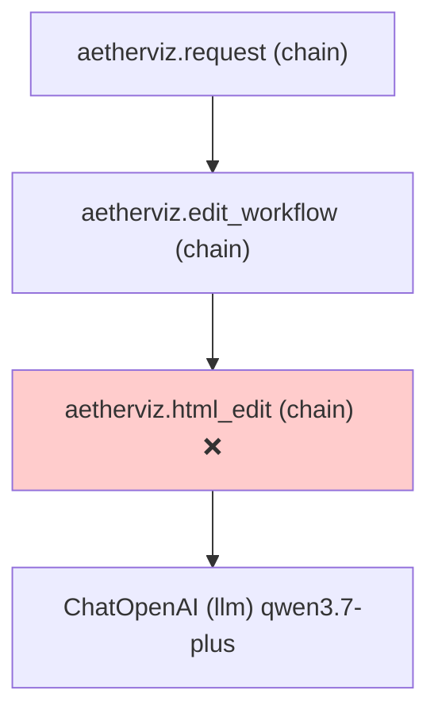

# LangSmith Trace 分析：HTML 编辑无效问题

## Trace 概要

| 属性 | 值 |
|---|---|
| Trace ID | `ef20206d-41cc-4ce3-96b3-04edc4bb18b5` |
| 模型 | `qwen3.7-plus` |
| 策略 | `full_html_regeneration` |
| 耗时 | 119.39s |
| finish_reason | `stop` (正常结束) |
| 输入 HTML | 27077 chars |
| 模型输出 | 27077 chars |
| 错误 | `candidate_unchanged` — 模型输出与原始 HTML 归一化后完全相同 |

## 调用链路



## 用户修改意见

> 实验控制的动画演示标题文字显示被挤压，请优化

## 根因分析

### 1. 模型原样复述了输入 HTML

模型花了 **119 秒**，输出了 27077 字符，但**逐字复述了原始 HTML**，没有做任何修改。归一化后 (`normalize_html_for_compare`，即 `"".join(text.split())`) 两者完全相同。

判定逻辑位于 `aetherviz_service/aetherviz/workflow/edit_html_workflow.py` 的第 257 行：

```python
if normalize_html_for_compare(current_html) == normalize_html_for_compare(edited_html):
    raise HtmlGenerationError(
        "HTML 修改失败，模型未产生实际变化，原页面已保留",
        code="edit_no_change",
        detail="candidate_unchanged",
    )
```

### 2. 问题根本原因：用户修改意见指向被 `extract_business_html` 移除的服务端外壳

用户说的是**「实验控制的动画演示标题文字显示被挤压」**——这指的是右侧控制面板中**「动画演示」**标签的文字被挤压。从截图看，标题和快速预设按钮、动画控制按钮区域的布局拥挤。

但实际 HTML 中，「动画演示」标签只是一个简单的 `<label class="control-label">动画演示</label>`，文字被挤压的根源很可能是：

- **服务端外壳（`#aetherviz-app-shell`）的布局约束**：`extract_business_html()` 在发给模型前已经剥离了服务端布局外壳，模型只看到了业务 HTML
- **控制面板的宽度受限**：在 `assemble_layout_contract` 装配后，右侧 `.av-primary-controls` 的宽度是 `280px`（grid 布局中定义的），在这个宽度下标题文字被挤压
- **模型只能编辑业务 HTML 内部的样式**，无法修改服务端控制的外壳宽度

这导致模型面临一个**无法解决的修改意见**：挤压是外壳布局导致的，但模型被告知"不得修改 `.av-*` 外壳"且实际也看不到外壳代码。**模型唯一能做的就是在业务 HTML 的 CSS 或 DOM 结构层面优化**，但它选择了原样输出。

### 3. qwen3.7-plus 模型能力问题

这个问题也反映了 `qwen3.7-plus` 在 HTML 编辑场景下的局限：

- **temperature=0.0**，关闭了 thinking（`enable_thinking: False`）
- 面对一个 27K 字符的长 HTML，模型可能在理解"哪里需要改"这件事上就遇到了困难
- 系统提示非常长（6985 chars），包含大量约束规则，可能让模型倾向于"不改比错改安全"
- 用户修改意见只有一句话（22 chars），相对于 27K HTML 和 7K 系统提示，信噪比极低

## 解决方案

### 方案 A：增强 edit 提示词的修改指导（低成本）

在 `build_edit_html_prompt` 中增加对修改意见的定位指导，帮模型缩小修改范围：

```diff
 def build_edit_html_prompt(
     *,
     instruction: str,
     current_html: str,
 ) -> str:
     return f"""请以当前 HTML 为唯一事实基线，根据本次用户修改意见定向改进，并重新输出完整业务 HTML。

 用户修改意见：{instruction}

 当前 HTML：
 {current_html}

-只实施本次修改意见要求的变化；用户未要求修改的教学内容、交互行为、视觉层级和功能必须保持一致。请直接输出重新生成后的完整 HTML。"""
+重要：你必须根据修改意见对 HTML 做出实际改动。即使改动很小（如调整一个 CSS 属性、增加 padding 或修改字号），也必须在输出中体现。绝对不要原样输出传入的 HTML。
+只实施本次修改意见要求的变化；用户未要求修改的教学内容、交互行为、视觉层级和功能必须保持一致。请直接输出重新生成后的完整 HTML。"""
```

> **注意**：这是最低成本的改动，但不能根本解决"布局由外壳控制而模型无法修改"的结构性问题。

### 方案 B：增加 candidate_unchanged 重试机制（推荐，中等成本）

当检测到 `candidate_unchanged` 时，不要立即报错，而是用更明确的指令重试一次。

在 `edit_html_workflow.py` 的第 257 行处增加重试逻辑：

```python
if normalize_html_for_compare(current_html) == normalize_html_for_compare(edited_html):
    if not _retry_attempted:
        # 用更强调的提示重试一次
        logger.warning("edit produced unchanged HTML, retrying with reinforced prompt")
        # 在提示中追加明确的差异要求
        yield from _retry_with_reinforced_prompt(...)
        return
    raise HtmlGenerationError(...)
```

> **建议**：重试时可以在 user message 中追加：`"上次你输出的 HTML 与原始完全相同。请务必针对用户修改意见做出实际改动，至少修改相关的 CSS 样式或 DOM 结构。"`

### 方案 C：为布局相关修改提供外壳上下文（较高级，较高成本）

当修改意见涉及「挤压」「布局」「宽度」「间距」等关键词时，在编辑提示中提供服务端外壳的关键布局信息（不是完整外壳代码，而是摘要）：

```python
def build_edit_html_prompt(*, instruction: str, current_html: str, layout_context: str = "") -> str:
    layout_hint = ""
    if layout_context:
        layout_hint = f"\n\n服务端布局上下文（只读，不可修改）：\n{layout_context}\n"
    return f"""..."""
```

当检测到修改意见包含布局关键词时：

```python
LAYOUT_KEYWORDS = {"挤压", "宽度", "间距", "布局", "太窄", "太宽", "溢出", "换行"}
if any(kw in message for kw in LAYOUT_KEYWORDS):
    layout_context = _extract_layout_summary(current_html)
```

### 方案 D：开启 thinking 模式或使用更强模型

当前 edit 配置：
- `temperature=0.0`
- `enable_thinking=False`

对于需要理解 27K HTML 并做定向修改的任务，可以考虑：

```python
# model_factory.py 中 kind == "edit" 分支
if kind == "edit":
    kwargs = _html_model_kwargs(max_tokens=settings.aetherviz_edit_max_tokens)
    kwargs["temperature"] = 0.1  # 略微提高温度避免原样复述
    # 考虑开启 thinking 让模型先分析需要改什么
    # kwargs["extra_body"] = {"enable_thinking": True}
```

或者在配置中允许 edit 使用独立的模型配置（如更强的推理模型）。

## 建议优先级

| 优先级 | 方案 | 成本 | 效果 |
|---|---|---|---|
| ⭐⭐⭐ | **B. 增加重试机制** | 中 | 直接解决"无变化就失败"的脆弱性 |
| ⭐⭐⭐ | **A. 增强提示词** | 低 | 减少模型原样复述的概率 |
| ⭐⭐ | **D. 开启 thinking / 提高温度** | 低 | 提升模型理解修改意图的能力 |
| ⭐ | **C. 提供外壳上下文** | 较高 | 根本解决布局类修改的可达性问题 |
